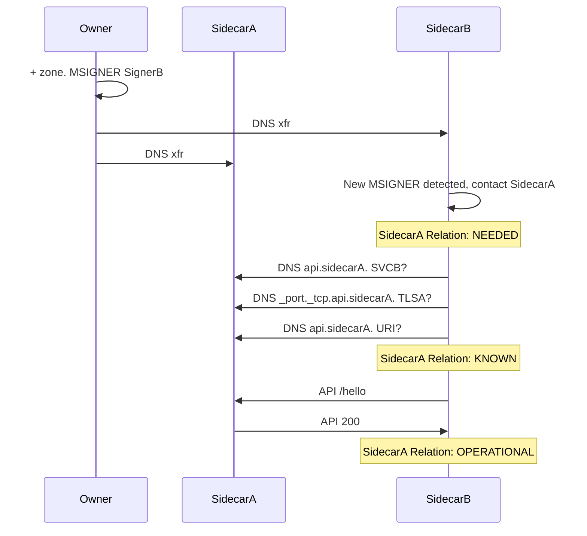
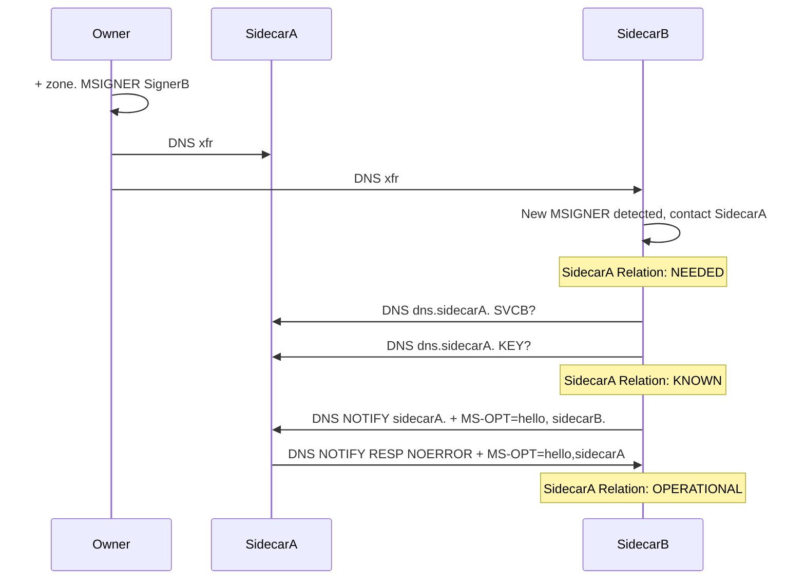
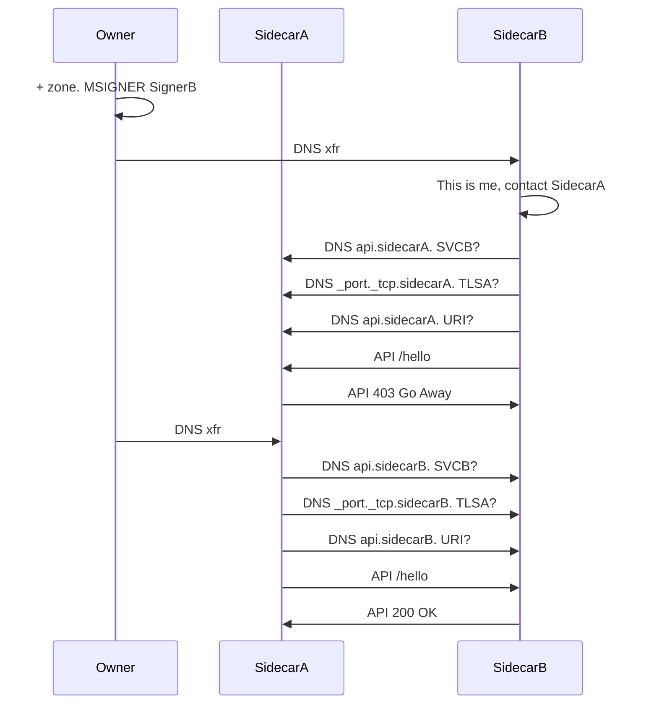
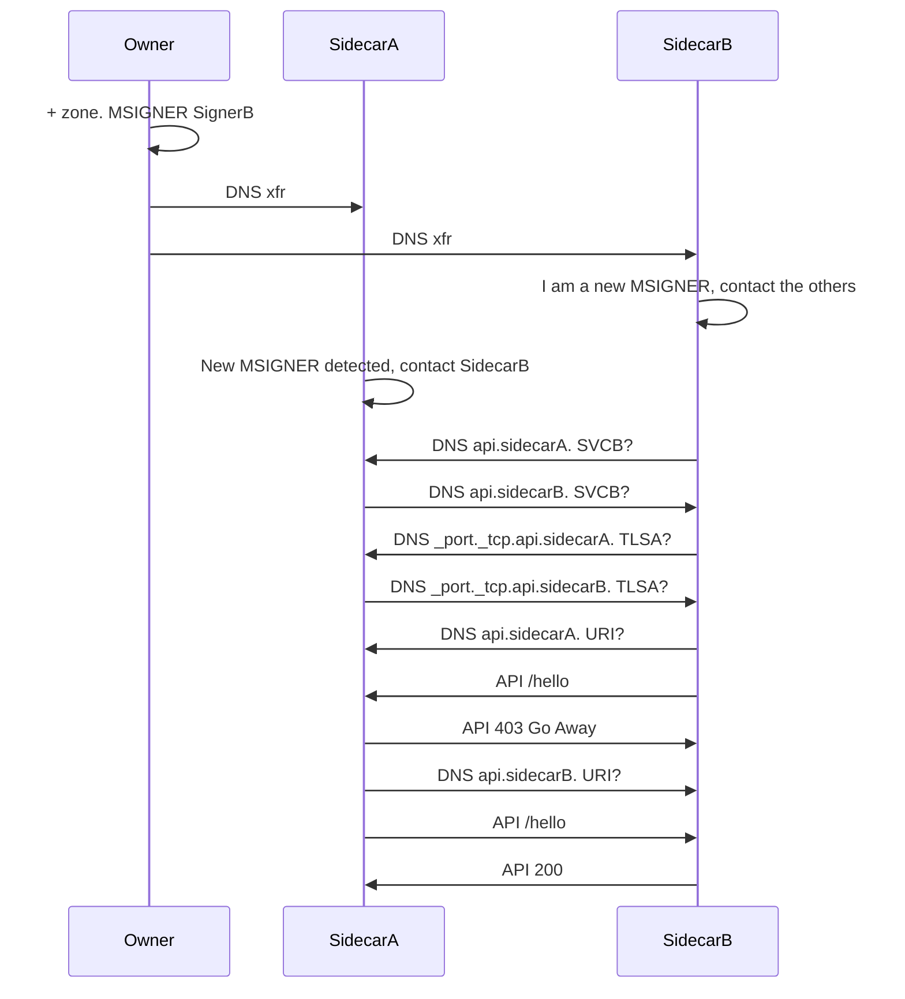

# Establishing a Secure Communication Between Sidecars
Sidecars need to establish a method of secure communication with eachother
before they can operate in a distributed multisigner fashion. This is done
by bootstrapping either an API-based (HTTPS w/mTLS) communication or a pure
DNS-based communication relying on transaction signatures.

At a high level, the flow is roughly: a sidecar gets a zone transfer and sees
some MSIGNER posts with itself and one or more unknown parties. It then looks
up some configuration parameters for each party using DNS. Lastly, it sends
either an API signal or a DNS signal to indicate readiness for distributed
multisigner operation with the other party.

Some examples of this establishment of communication are given as sequence
diagrams below.

## Basic Establishment of API-based Communication
The basic scenario where sidecarB contacts sidecarA and establishes a secure
communication between the two. After getting a 200 OK response, sidecarA
considers sidecarB to be OPERATIONAL. Likewise, after responding with
200 OK, sidecarA considers sidecarB to be operational.

## Basic Establishment of DNS-based Communication
Same as the previous example, but secure DNS-based communication is
established.

## Establishment with a Delay in XFR for a Sidecar
In case of a delay in between the zone transfer to sidecarA and sidecarB,
sidecarA might not now about sidecarB when it gets the "/hello" signal.
It will then respond with a suitable error code to indicate it is not ready
for an operational state. Sometime later, when sidecarA receives the zone
transfer, it performs the necessary DNS lookups and sends the "/hello" signal
to sidecarB, which then responds with 200 OK to indicate readiness.

## Establishment with Two Sidecars Performing Lookup Simultaneously
Similarly to the previous example, if the "/hello" arrives while sidecarA is
performing its DNS lookups, it just responds with some error code. Once
sidecarA is done, it sends "/hello" and gets a 200 OK.

